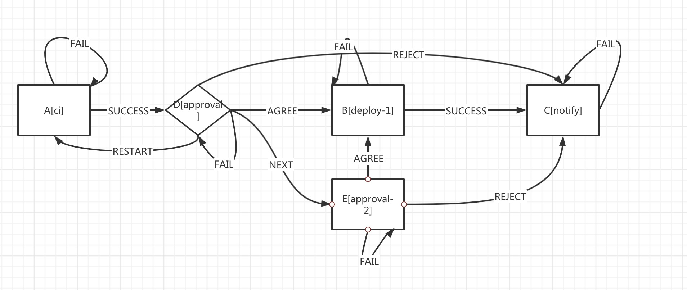

## echoer
custom process driven system custom business event middleware

### echoer design

1. FSM mathematical model
2. resource has [flow,flow_run,step,action,action_run]
2. FSL (DSL) support action,flow,flow_run

### api-server
1. front end api

### flow controller
1. flow run logic handler 

### action controller
1. implements action callback use http
2. reconcile flow run action callback(webhook)


### how to extend action


1. design flows and edit FSL 
```
action ci
	addr = "http://localhost:18080/ci";
	method = http;
	args = (str project,str version,int retry_count);
	return = (SUCCESS | FAIL);
action_end
/

action approval
	addr = "http://localhost:18080/approval";
	method = http;
	args = (str work_order,int version);
	return = (AGREE | REJECT | NEXT | FAIL);
action_end
/

action deploy_1
	addr = "http://localhost:18080/deploy";
	method = http;
	args = (str project, int version);
	return = (SUCCESS | FAIL);
action_end
/

action approval_2
	addr = "http://localhost:18080/approval2";
	method = http;
	args = (str project, int version);
	return = (AGREE | REJECT | FAIL);
action_end
/

action notify
	addr = "http://localhost:18080/notify";
	method = http;
	args = (str project, int version);
	return = (SUCCESS | FAIL);
action_end
/

flow_run my_flow_run_1
	step A => (SUCCESS->D | FAIL->A) {
		action = "ci";
		args = (project="https://github.com/yametech/compass.git",version="v0.1.0",retry_count=10);
	};
	step D => ( AGREE -> B | REJECT -> C | NEXT -> E | FAIL -> D ) {
		action="approval";
		args=(work_order="nz00001",version=12343);
	};
	step B => (FAIL->B | SUCCESS->C) {
		action="deploy_1";
		args=(project="nz00001",version=12343);
	};
	step E => (REJECT->C | AGREE->B | FAIL->E) {
		action="approval_2";
		args=(project="nz00001",version=12343);
	};
    step C => (SUCCESS->done | FAIL->C){
        action="notify";
        args=(project="nz00001",version=12343);
    };
flow_run_end
```

2. your code

You need to serve the business to http and receive the request request contains the following fields,example ref: e2e/flow_impl/action/ci.go/request struct
```
FlowId           string `json:"flowId"`
StepName         string `json:"stepName"`
AckState         string `json:"ackState"`
UUID             string `json:"uuid"`
...
```

The "ci" action has args (str project,str version,int retry_count) , so the business field add in the struct

```
type ciRequest struct {
	FlowId   string `json:"flowId"`
	StepName string `json:"stepName"`
	AckState string `json:"ackState"`
	UUID     string `json:"uuid"`
	//ci action args
	Project    string `json:"project"`
	Version    int    `json:"version"`
	RetryCount string `json:"retry_count"`
}
```
 
The "ci" action need to respond to the status back to api-server /step when completing the business

```
type Response struct {
	FlowId   string `json:"flowId"`
	StepName string `json:"stepName"`
	AckState string `json:"ackState"`
	UUID     string `json:"uuid"`
	Done     bool   `json:"done"`
}
```


3. terminal access to api-server
